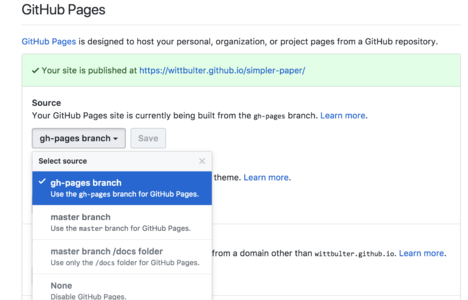

## QuickStart
[simpler-paper](https://github.com/DhyanaChina/simpler-paper) is a minimalist document generator.
you only need to run a command, all of the Markdown will be automatically integrated into the site.

In principle, we have reduced the configuration as much as possible, most of the functions are customary,
you can find the way to use in the **feature** directory.

In addition, we have also prepared a different style of css-style for you, you never to worry about style. everything is so simple.


### Build and preview    
with just one command, you can easily compile the file and the local preview.
```bash
# install 
npm install -g simpler-paper  

# init  
paper init

# dont forget to add some markdown files.
# build to html
paper build 

# preview  
paper s
```

### Deploy

```bash  
# In default, the document will be released to github.    
paper deploy
```

you need set github pages (maybe...🙄):

  1. go to your rep.
  2. Settings > Options > GitHub Pages  
  3. choose the source for **gh-pages branch**
  
the actual effect:     




