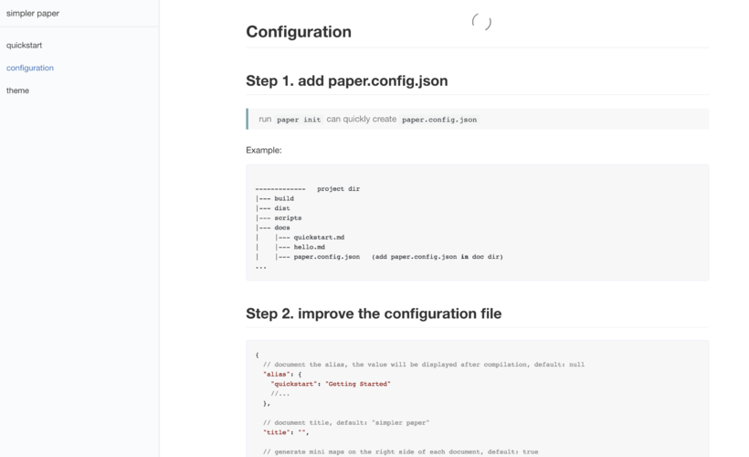
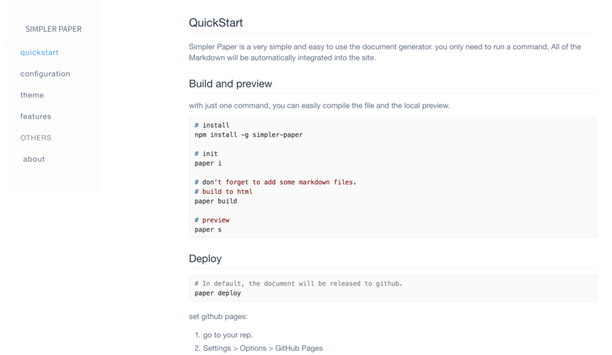
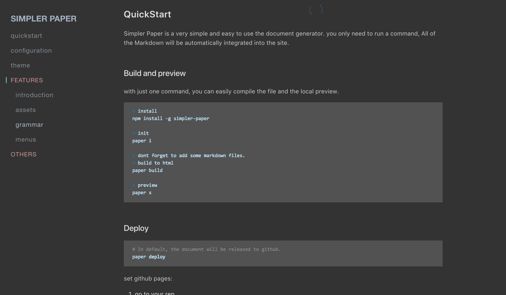

## Theme
The sense of design has always been a part of our great importance, we hope simpler-paper is not just readable,
it also needs to be pleasing, charismatic and special.

the style of the **simpler-paper** comes from [simpler-paper-themes](https://github.com/DhyanaChina/simpler-paper-themes).
here is a list of all topics at present.   

> if you want to create a new theme, go to [simpler-paper-themes](https://github.com/DhyanaChina/simpler-paper-themes).

- Default `theme: "default"`

 
 
- Element `theme: "element"`

  

- Plain `theme: "plain"`

  

- Dark `theme: "dark`

  

